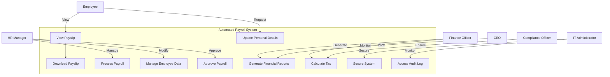

```mermaid
%% Use Case Diagram for Automated Payroll System
%% Actors: Employee, HR Manager, Finance Officer, IT Administrator, Compliance Officer, CEO
%% Use Cases: View Payslip, Process Payroll, Manage Employee Data, Generate Reports, Calculate Tax, Approve Payroll, Secure System, Access Audit Log

graph TD;
    subgraph "Automated Payroll System"
        B[View Payslip] --> P[Download Payslip]
        C[Update Personal Details]
        E[Process Payroll]
        F[Manage Employee Data]
        G[Approve Payroll]
        I[Generate Financial Reports]
        J[Calculate Tax]
        L[Secure System]
        M[Access Audit Log]
    end
    
    A[Employee] -->|View| B;
    A -->|Request| C;
    
    D[HR Manager] -->|Manage| E;
    D -->|Modify| F;
    D -->|Approve| G;
    
    H[Finance Officer] -->|Generate| I;
    H -->|Monitor| J;
    
    K[IT Administrator] -->|Secure| L;
    K -->|Monitor| M;
    
    N[Compliance Officer] -->|Ensure| J;
    
    O[CEO] -->|View| I;
```

